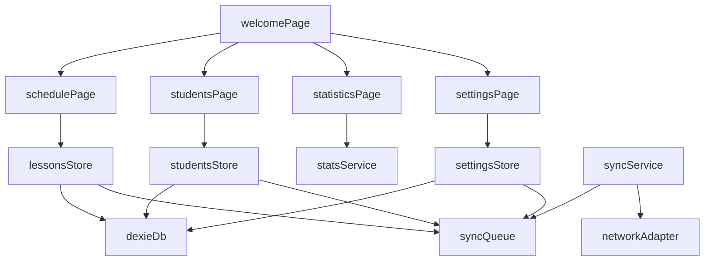

# План реализации PWA TimeCash (FSD)

## 1) База проекта и маршрутизация

- Перейти от текущих демо-экранов к FSD-структуре: `app`, `pages`, `widgets`, `features`, `entities`, `shared`.
- Обновить роуты TanStack Router для экранов:
  - приветствие
  - расписание
  - студенты
  - статистика
  - параметры
- Использовать нижнюю мобильную навигацию (tab bar) + компактный header с action-кнопками: это быстрее и удобнее на iOS/Android, чем постоянный hamburger для частых переходов.

Ключевые текущие файлы для опоры:

- `[/home/rorschach/work/pets/timecash-app/src/routes/__root.tsx](/home/rorschach/work/pets/timecash-app/src/routes/__root.tsx)`
- `[/home/rorschach/work/pets/timecash-app/src/routes/index.tsx](/home/rorschach/work/pets/timecash-app/src/routes/index.tsx)`
- `[/home/rorschach/work/pets/timecash-app/src/shared/ui/button.tsx](/home/rorschach/work/pets/timecash-app/src/shared/ui/button.tsx)`

## 2) Доменная модель и local-first хранение

- Ввести `entities`:
  - `student` (id, fullName, isArchived, createdAt, updatedAt)
  - `lessonRow` (date, startTime, endTime, studentAId, studentBId)
  - `settings` (hourlyRateSingle, hourlyRatePair, themeMode)
- Использовать IndexedDB через Dexie (уже установлен) как основной источник данных.
- Добавить таблицу `syncQueue` для будущей периодической отправки изменений на сервер.
- Слой репозиториев/сервисов в `shared/api` или `entities/*/model` для единообразного доступа к данным.

## 3) Экран «Расписание» (главный сценарий)

- Date picker для выбора дня.
- После выбора даты показывать список строк занятий.
- Важно: любой выбранный день, включая прошедшие даты, должен быть редактируемым (без ограничений только на «сегодня и будущее»).
- Строка содержит:
  - `startTime` (`hh:mm`)
  - `endTime` (`hh:mm`)
  - `studentA` select (включая `Свободно`)
  - `studentB` select (включая `Свободно`)
  - кнопка `Добавить` (появляется у валидно заполненной строки и создаёт новую пустую)
- Ключевая логика автоподстановки:
  - если для этого дня нет строк, искать заполненный такой же день недели на предыдущей неделе;
  - при наличии копировать значения в новый день как стартовый шаблон.
- Валидации:
  - `endTime > startTime`
  - запрет одинакового студента в `studentA/studentB`
  - корректная обработка `Свободно`.

## 4) Экран «Студенты»

- Список учеников с действиями `Редактировать` / `Удалить`.
- Кнопка `Добавить` открывает модалку ввода ФИО.
- Удаление и редактирование через подтверждающие/редактирующие модалки.
- Мягкое удаление (`isArchived`) вместо физического удаления для сохранения исторических данных в расписании.

## 5) Экран «Статистика»

- Диапазон дат: один range picker или два date input (start/end).
- Кнопка `Показать` запускает расчёт:
  - суммарные часы занятий за период
  - суммарный доход (почасовая модель)
- Правила дохода:
  - если активны два ученика в строке -> используется `hourlyRatePair`
  - если один ученик -> `hourlyRateSingle`
  - если оба `Свободно` -> строка не учитывается
- Доход = длительность(в часах) × соответствующая ставка.

## 6) Экран «Параметры»

- Поля:
  - цена за час для одного ученика
  - цена за час для пары
- Кнопка `Сохранить`.
- Валидация положительных чисел и форматирования.

## 7) Тема, UX и PWA-фокус для iOS/Android

- Реализовать theme system:
  - `system` (по умолчанию), `light`, `dark`
  - инициализация от `prefers-color-scheme`
  - переключатель темы в UI
- Упор на mobile UX:
  - крупные touch-targets, sticky actions, быстрые повторяемые сценарии ввода расписания
  - состояния empty/loading/success/error и дружелюбные тексты
- PWA-улучшения:
  - корректные manifest-поля для installability на iOS/Android
  - offline-fallback экран
  - проверка кэширования и обновления SW

## 8) Синхронизация (без API на этапе 1)

- Реализовать базовый `syncService` с таймером/триггерами (app focus/online event).
- Пока без реальной отправки: подготовить очередь операций и статус синка (`pending`, `synced`, `failed`) для прозрачного UX.
- Вынести адаптер сети, чтобы потом безболезненно подключить backend endpoints.

## 9) Предлагаемые зависимости к согласованию

- Рекомендуется добавить:
  - `date-fns` — работа с датами/диапазонами/днём недели
  - `react-hook-form` + `zod` — предсказуемые формы и валидация
- Без них тоже можно, но код станет менее устойчивым и более многословным.
- Пакетный менеджер для всех команд установки/скриптов: `bun` (`bun add`, `bun run ...`).

## 10) Проверка качества

- Минимальные unit-тесты для:
  - расчёта часов/дохода
  - автоподстановки расписания с прошлой недели
  - редактирования расписания за прошедшие дни
  - ключевых валидаторов формы
- Обязательный линтинг после изменений: `bun run lint` с устранением замечаний в изменённых файлах.
- Ручной smoke для PWA:
  - офлайн-ввод/перезапуск приложения/сохранность данных
  - восстановление сети и обработка очереди sync

## Что будет результатом этапа

- Полноценный PWA local-first MVP для iOS/Android с FSD-архитектурой.
- Все 5 экранов из ТЗ, рабочая тема (system/light/dark), офлайн-сохранение и готовая база для последующей серверной синхронизации.
